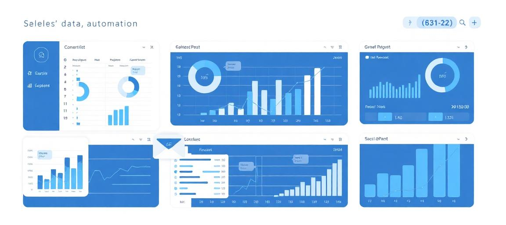

# Pysend - Sistema de Automação de Relatórios de Vendas



## 📋 Visão Geral

O **Pysend** é um sistema web moderno e intuitivo para automação de relatórios de vendas. Desenvolvido para facilitar o processamento de dados Excel e o envio automático de relatórios por email, oferece uma interface profissional que substitui processos manuais por fluxos automatizados.

### 🚀 Características Principais

- **Interface Web Moderna**: Dashboard profissional com design responsivo
- **Upload Drag & Drop**: Carregamento simples de arquivos Excel
- **Configuração Flexível de Email**: Personalização completa do destinatário e conteúdo
- **Visualização de Dados**: Cards e tabelas interativas com métricas de vendas
- **Processamento Automatizado**: Simulação de processamento com feedback visual
- **Sistema de Configurações**: Painel completo para personalização do sistema

### 🛠️ Tecnologias Utilizadas

#### Frontend
- **React 18** - Framework JavaScript moderno
- **TypeScript** - Tipagem estática para maior segurança
- **Tailwind CSS** - Framework CSS utilitário
- **Vite** - Build tool rápido e moderno
- **Shadcn/ui** - Componentes UI elegantes
- **React Router** - Navegação SPA
- **Lucide React** - Ícones SVG otimizados

#### Funcionalidades Especiais
- **React Dropzone** - Upload de arquivos com drag & drop
- **Toast Notifications** - Feedback visual para usuário
- **Design System** - Tema consistente com tokens customizáveis
- **Responsive Design** - Compatível com todos os dispositivos

## 🎯 Funcionalidades

### 1. Dashboard Principal
- **Métricas em Tempo Real**: Visualização de KPIs importantes
- **Atividade Recente**: Timeline das últimas operações
- **Status do Sistema**: Monitoramento de componentes
- **Ações Rápidas**: Acesso direto às funcionalidades principais

### 2. Upload de Arquivos
- **Drag & Drop Interface**: Upload visual e intuitivo
- **Validação de Formato**: Aceita apenas arquivos Excel (.xlsx, .xls)
- **Progresso de Upload**: Barra de progresso em tempo real
- **Feedback Visual**: Notificações de sucesso/erro

### 3. Configuração de Email
- **Destinatário Personalizável**: Alteração do email de envio
- **Templates Customizáveis**: Assunto e mensagem personalizados
- **Configurações Avançadas**: Opções para gráficos e envio automático
- **Validação de Dados**: Verificação de formato de email

### 4. Relatórios e Análises
- **Métricas de Vendas**: Receita, quantidade, ticket médio
- **Tabelas Interativas**: Ordenação e filtragem de dados
- **Performance por Loja**: Análise comparativa
- **Exportação CSV**: Download dos dados processados

### 5. Configurações do Sistema
- **Configurações SMTP**: Setup completo de email
- **Notificações**: Controle de alertas do sistema
- **Segurança**: Configurações de autenticação e logs
- **Backup**: Gerenciamento de arquivos processados

## 📁 Estrutura do Projeto

```
pysend/
├── src/
│   ├── components/           # Componentes reutilizáveis
│   │   ├── ui/              # Componentes base (shadcn)
│   │   ├── FileUpload.tsx   # Upload de arquivos
│   │   ├── EmailConfig.tsx  # Configuração de email
│   │   ├── SalesMetrics.tsx # Métricas de vendas
│   │   └── SalesTable.tsx   # Tabela de dados
│   ├── pages/               # Páginas da aplicação
│   │   ├── Index.tsx        # Dashboard principal
│   │   ├── Upload.tsx       # Página de upload
│   │   ├── Reports.tsx      # Relatórios
│   │   └── Settings.tsx     # Configurações
│   ├── assets/              # Recursos estáticos
│   ├── hooks/               # Hooks customizados
│   ├── lib/                 # Utilitários
│   └── styles/              # Estilos globais
├── docs/                    # Documentação
├── public/                  # Arquivos públicos
└── package.json            # Dependências
```

## 🎨 Design System

### Cores Principais
- **Primary**: Azul profissional (`#3b82f6`)
- **Success**: Verde para sucessos (`#10b981`)
- **Accent**: Azul vibrante para destaque (`#06b6d4`)
- **Muted**: Cinzas para textos secundários

### Componentes Estilizados
- **Cards**: Com gradientes sutis e sombras elegantes
- **Botões**: Variações com efeitos hover e gradientes
- **Inputs**: Design limpo com foco visual
- **Badges**: Indicadores coloridos para status

### Animações
- **Transições Suaves**: 300ms cubic-bezier
- **Hover Effects**: Efeitos de escala e brilho
- **Loading States**: Skeleton screens e spinners
- **Micro-interações**: Feedback visual para ações

## 🔧 Instalação e Configuração

### Pré-requisitos
- Node.js 18+ 
- npm ou yarn
- Navegador moderno

### Instalação

```bash
# Clone o repositório
git clone <url-do-repositorio>
cd pysend

# Instale as dependências
npm install

# Execute o projeto
npm run dev
```

### Configuração
1. Acesse `http://localhost:8080`
2. Configure seu email SMTP nas configurações
3. Faça upload do primeiro arquivo Excel
4. Personalize as configurações conforme necessário

## 📖 Guia de Uso

### 1. Primeiro Acesso
1. **Dashboard**: Visualize o status geral do sistema
2. **Upload**: Faça upload do seu primeiro arquivo Excel
3. **Configurações**: Configure seu email SMTP

### 2. Processamento de Arquivos
1. Navegue para **Upload**
2. Arraste seu arquivo Excel ou clique para selecionar
3. Configure o email destinatário
4. Clique em **Processar e Enviar Relatório**

### 3. Visualização de Relatórios
1. Acesse **Relatórios** para ver dados processados
2. Analise métricas por loja
3. Exporte dados em CSV se necessário

### 4. Configurações Avançadas
1. **Email**: Configure SMTP, templates e opções
2. **Notificações**: Controle alertas do sistema
3. **Segurança**: Configure autenticação e logs
4. **Backup**: Gerencie arquivos processados

## 🔒 Segurança

- **Validação de Arquivos**: Apenas formatos Excel aceitos
- **Sanitização de Dados**: Limpeza de inputs do usuário
- **Logs de Atividade**: Rastreamento de operações
- **Timeouts Configuráveis**: Controle de sessão

## 🚀 Deploy

### Ambiente de Produção
```bash
# Build de produção
npm run build

# Preview do build
npm run preview
```

### Hospedagem
- **Netlify**: Deploy automático via Git
- **Vercel**: Integração com repositório
- **AWS S3**: Hospedagem estática
- **Servidor próprio**: Via nginx/apache

## 🤝 Contribuição

1. Fork o projeto
2. Crie sua branch (`git checkout -b feature/nova-funcionalidade`)
3. Commit suas mudanças (`git commit -m 'Adiciona nova funcionalidade'`)
4. Push para a branch (`git push origin feature/nova-funcionalidade`)
5. Abra um Pull Request

## 📋 Roadmap

### Versão 2.0
- [ ] Integração com APIs externas
- [ ] Múltiplos formatos de arquivo
- [ ] Dashboard analítico avançado
- [ ] Sistema de usuários

### Versão 2.1
- [ ] Agendamento de relatórios
- [ ] Templates de email HTML
- [ ] Integração com BI tools
- [ ] App móvel

## 📄 Licença

Este projeto está sob a licença MIT. Veja o arquivo [LICENSE](LICENSE) para mais detalhes.

## 📞 Suporte

- **Email**: contato.pedromoratolahoz@gmail.com
- **Documentação**: [docs/](docs/)
- **Issues**: [GitHub Issues](https://github.com/seu-usuario/pysend/issues)

---

**Desenvolvido com ❤️ para automação de relatórios de vendas**