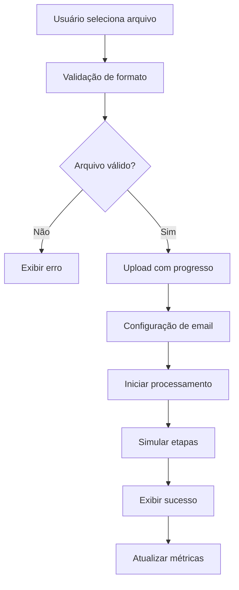
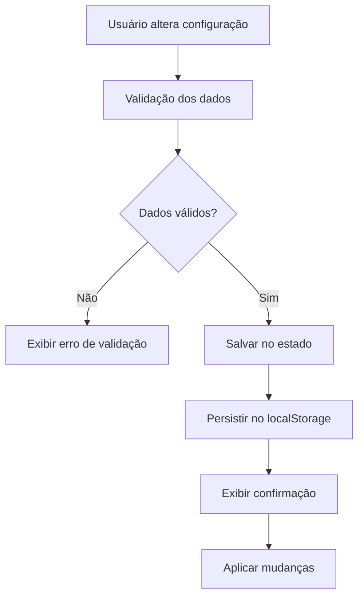

# 🛠️ Documentação Técnica - Pysend

## 🏗️ Arquitetura do Sistema

### Visão Geral
O Pysend é uma Single Page Application (SPA) construída com React e TypeScript, utilizando uma arquitetura modular e escalável.

```
┌─────────────────┐    ┌──────────────────┐    ┌─────────────────┐
│   Frontend      │    │   Processing     │    │   Email SMTP    │
│   React + TS    │◄──►│   Simulation     │◄──►│   External      │
│                 │    │                  │    │                 │
└─────────────────┘    └──────────────────┘    └─────────────────┘
         │                       │                       │
         ▼                       ▼                       ▼
┌─────────────────┐    ┌──────────────────┐    ┌─────────────────┐
│   Local Storage │    │   File System    │    │   Logs System   │
│   Settings      │    │   Upload/Cache   │    │   Activity      │
└─────────────────┘    └──────────────────┘    └─────────────────┘
```

### Padrões Arquiteturais
- **Component-Based**: Componentes reutilizáveis e modulares
- **Composition Over Inheritance**: Composição de funcionalidades
- **Separation of Concerns**: Separação clara de responsabilidades
- **Single Responsibility**: Cada componente tem uma responsabilidade

## 📁 Estrutura de Diretórios

```
src/
├── components/              # Componentes reutilizáveis
│   ├── ui/                 # Componentes base (shadcn/ui)
│   │   ├── button.tsx      # Componente de botão
│   │   ├── card.tsx        # Componente de card
│   │   ├── input.tsx       # Componente de input
│   │   ├── sidebar.tsx     # Componente de sidebar
│   │   └── app-sidebar.tsx # Sidebar customizada
│   ├── FileUpload.tsx      # Upload de arquivos
│   ├── EmailConfig.tsx     # Configuração de email
│   ├── SalesMetrics.tsx    # Métricas de vendas
│   └── SalesTable.tsx      # Tabela de dados
├── pages/                  # Páginas da aplicação
│   ├── Index.tsx          # Dashboard principal
│   ├── Upload.tsx         # Página de upload
│   ├── Reports.tsx        # Página de relatórios
│   ├── Settings.tsx       # Página de configurações
│   └── NotFound.tsx       # Página 404
├── hooks/                 # Hooks customizados
│   ├── use-toast.ts       # Hook para notificações
│   └── use-mobile.tsx     # Hook para detecção mobile
├── lib/                   # Utilitários e helpers
│   └── utils.ts           # Funções utilitárias
├── assets/               # Recursos estáticos
│   └── dashboard-hero.jpg # Imagem do dashboard
├── styles/               # Estilos globais
│   └── index.css         # CSS global e design system
└── types/                # Definições de tipos TypeScript
    └── index.ts          # Tipos customizados
```

## 🎨 Design System

### Tokens de Cor (HSL)
```css
:root {
  /* Cores Principais */
  --primary: 221 83% 53%;        /* Azul principal */
  --primary-glow: 221 83% 65%;   /* Azul brilhante */
  --secondary: 210 40% 96%;      /* Cinza claro */
  --accent: 217 91% 60%;         /* Azul vibrante */
  --success: 142 76% 36%;        /* Verde sucesso */
  --destructive: 0 84% 60%;      /* Vermelho erro */
  
  /* Gradientes */
  --gradient-primary: linear-gradient(135deg, hsl(var(--primary)), hsl(var(--primary-glow)));
  --gradient-subtle: linear-gradient(180deg, hsl(0 0% 100%), hsl(220 14% 98%));
  --gradient-card: linear-gradient(145deg, hsl(0 0% 100%), hsl(220 14% 99%));
  
  /* Sombras */
  --shadow-card: 0 4px 6px -1px rgb(0 0 0 / 0.1);
  --shadow-elevated: 0 10px 15px -3px rgb(0 0 0 / 0.1);
  --shadow-glow: 0 0 20px hsl(var(--primary) / 0.3);
  
  /* Animações */
  --transition-smooth: all 0.3s cubic-bezier(0.4, 0, 0.2, 1);
}
```

### Componentes Base
```typescript
// Exemplo de componente com variantes
const buttonVariants = cva(
  "inline-flex items-center justify-center rounded-md text-sm font-medium",
  {
    variants: {
      variant: {
        default: "bg-primary text-primary-foreground hover:bg-primary/90",
        secondary: "bg-secondary text-secondary-foreground hover:bg-secondary/80",
        outline: "border border-input bg-background hover:bg-accent",
      },
      size: {
        default: "h-10 px-4 py-2",
        sm: "h-9 rounded-md px-3",
        lg: "h-11 rounded-md px-8",
      },
    },
    defaultVariants: {
      variant: "default",
      size: "default",
    },
  }
)
```

## 🔧 Componentes Principais

### FileUpload Component
```typescript
interface FileUploadProps {
  onFileUpload: (file: File) => void;
  isProcessing?: boolean;
}

// Funcionalidades:
// - Drag & drop de arquivos
// - Validação de formato (.xlsx, .xls)
// - Feedback visual de progresso
// - Notificações de erro/sucesso
```

### EmailConfig Component
```typescript
interface EmailConfig {
  toEmail: string;
  fromName: string;
  subject: string;
  customMessage: string;
  includeCharts: boolean;
  autoSend: boolean;
}

// Funcionalidades:
// - Validação de email
// - Templates personalizáveis
// - Configurações avançadas
// - Persistência local
```

### SalesMetrics Component
```typescript
interface SalesData {
  store: string;
  revenue: number;
  quantity: number;
  averageTicket: number;
}

// Funcionalidades:
// - Cálculo automático de métricas
// - Visualização em cards
// - Estados de loading
// - Formatação monetária brasileira
```

## 🎯 Estado da Aplicação

### Gerenciamento de Estado
```typescript
// useState para estado local
const [isProcessing, setIsProcessing] = useState(false);
const [uploadedFile, setUploadedFile] = useState<File | null>(null);

// useReducer para estado complexo
const [state, dispatch] = useReducer(configReducer, initialState);

// React Query para dados server-side (futuro)
const { data, isLoading, error } = useQuery(['sales'], fetchSales);
```

### Persistência Local
```typescript
// Configurações persistidas no localStorage
const savedConfig = localStorage.getItem('pysend-config');
const config = savedConfig ? JSON.parse(savedConfig) : defaultConfig;
```

## 🔄 Fluxo de Dados

### Upload e Processamento


### Configurações


## 🛡️ Validação e Segurança

### Validação de Arquivos
```typescript
const validateFile = (file: File): boolean => {
  // Validação de extensão
  const validExtensions = ['.xlsx', '.xls'];
  const extension = file.name.toLowerCase().slice(-5);
  
  // Validação de tamanho
  const maxSize = 50 * 1024 * 1024; // 50MB
  
  // Validação de tipo MIME
  const validMimeTypes = [
    'application/vnd.openxmlformats-officedocument.spreadsheetml.sheet',
    'application/vnd.ms-excel'
  ];
  
  return validExtensions.some(ext => extension.includes(ext)) &&
         file.size <= maxSize &&
         validMimeTypes.includes(file.type);
};
```

### Sanitização de Dados
```typescript
const sanitizeInput = (input: string): string => {
  return input
    .trim()
    .replace(/[<>]/g, '') // Remove caracteres perigosos
    .slice(0, 255); // Limita tamanho
};
```

### Validação de Email
```typescript
const validateEmail = (email: string): boolean => {
  const emailRegex = /^[^\s@]+@[^\s@]+\.[^\s@]+$/;
  return emailRegex.test(email) && email.length <= 254;
};
```

## 📱 Responsividade

### Breakpoints
```css
/* Mobile First */
.container {
  width: 100%;
  padding: 1rem;
}

/* Tablet */
@media (min-width: 768px) {
  .container {
    max-width: 768px;
    padding: 2rem;
  }
}

/* Desktop */
@media (min-width: 1024px) {
  .container {
    max-width: 1024px;
  }
}

/* Large Desktop */
@media (min-width: 1280px) {
  .container {
    max-width: 1280px;
  }
}
```

### Componentes Adaptativos
```typescript
const useIsMobile = () => {
  const [isMobile, setIsMobile] = useState(false);
  
  useEffect(() => {
    const checkDevice = () => {
      setIsMobile(window.innerWidth < 768);
    };
    
    checkDevice();
    window.addEventListener('resize', checkDevice);
    return () => window.removeEventListener('resize', checkDevice);
  }, []);
  
  return isMobile;
};
```

## ⚡ Performance

### Otimizações Implementadas
1. **Code Splitting**: Componentes carregados sob demanda
2. **Lazy Loading**: Imagens e rotas carregadas quando necessário
3. **Memoization**: Componentes memoizados com React.memo
4. **Bundle Optimization**: Tree shaking e minificação
5. **Asset Optimization**: Imagens otimizadas e comprimidas

### Bundle Analysis
```bash
# Analise do bundle (configuração futura)
npm run build:analyze

# Tamanhos aproximados:
# - Chunk principal: ~200KB (gzipped)
# - Vendor libraries: ~300KB (gzipped)
# - Assets: ~50KB
```

### Métricas Core Web Vitals
- **LCP (Largest Contentful Paint)**: < 2.5s
- **FID (First Input Delay)**: < 100ms
- **CLS (Cumulative Layout Shift)**: < 0.1

## 🔌 Integrações

### React Dropzone
```typescript
import { useDropzone } from 'react-dropzone';

const { getRootProps, getInputProps, isDragActive } = useDropzone({
  accept: {
    'application/vnd.openxmlformats-officedocument.spreadsheetml.sheet': ['.xlsx'],
    'application/vnd.ms-excel': ['.xls']
  },
  maxFiles: 1,
  onDrop: handleFileUpload
});
```

### Toast Notifications
```typescript
import { useToast } from '@/hooks/use-toast';

const { toast } = useToast();

toast({
  title: "Sucesso",
  description: "Operação realizada com sucesso",
  className: "bg-success text-success-foreground"
});
```

## 🧪 Testes (Futuro)

### Estrutura de Testes
```
tests/
├── components/          # Testes de componentes
├── pages/              # Testes de páginas
├── hooks/              # Testes de hooks
├── utils/              # Testes de utilitários
└── e2e/                # Testes end-to-end
```

### Ferramentas Sugeridas
- **Vitest**: Framework de testes rápido
- **Testing Library**: Testes focados no usuário
- **MSW**: Mock Service Worker para APIs
- **Playwright**: Testes end-to-end

## 📈 Monitoramento

### Logs de Desenvolvimento
```typescript
const logger = {
  info: (message: string, data?: any) => {
    if (process.env.NODE_ENV === 'development') {
      console.log(`[INFO] ${message}`, data);
    }
  },
  error: (message: string, error?: Error) => {
    console.error(`[ERROR] ${message}`, error);
  }
};
```

### Error Boundaries
```typescript
class ErrorBoundary extends Component {
  constructor(props) {
    super(props);
    this.state = { hasError: false };
  }

  static getDerivedStateFromError(error) {
    return { hasError: true };
  }

  componentDidCatch(error, errorInfo) {
    logger.error('React Error Boundary', { error, errorInfo });
  }

  render() {
    if (this.state.hasError) {
      return <ErrorFallback />;
    }

    return this.props.children;
  }
}
```

## 🚀 Build e Deploy

### Vite Configuration
```typescript
export default defineConfig({
  plugins: [react(), componentTagger()],
  build: {
    target: 'es2015',
    outDir: 'dist',
    sourcemap: true,
    rollupOptions: {
      output: {
        manualChunks: {
          vendor: ['react', 'react-dom'],
          ui: ['@radix-ui/react-dialog', '@radix-ui/react-dropdown-menu']
        }
      }
    }
  },
  server: {
    port: 8080,
    host: true
  }
});
```

### Environment Variables
```bash
# Development
VITE_APP_VERSION=1.0.0
VITE_API_BASE_URL=http://localhost:3000

# Production
VITE_APP_VERSION=1.0.0
VITE_API_BASE_URL=https://api.pysend.com
```

## 🔄 Roadmap Técnico

### Versão 2.0
- [ ] **Backend API**: Node.js + Express + PostgreSQL
- [ ] **Autenticação**: JWT + refresh tokens
- [ ] **Testes**: Cobertura 90%+
- [ ] **PWA**: Service Workers + Cache API
- [ ] **Internacionalização**: i18n completo

### Versão 2.1
- [ ] **Real-time**: WebSockets para atualizações
- [ ] **Microservices**: Arquitetura distribuída
- [ ] **Docker**: Containerização completa
- [ ] **CI/CD**: Pipeline automatizado
- [ ] **Monitoring**: APM e observabilidade

---

**Para dúvidas técnicas específicas, consulte o código-fonte ou abra uma issue no GitHub.**